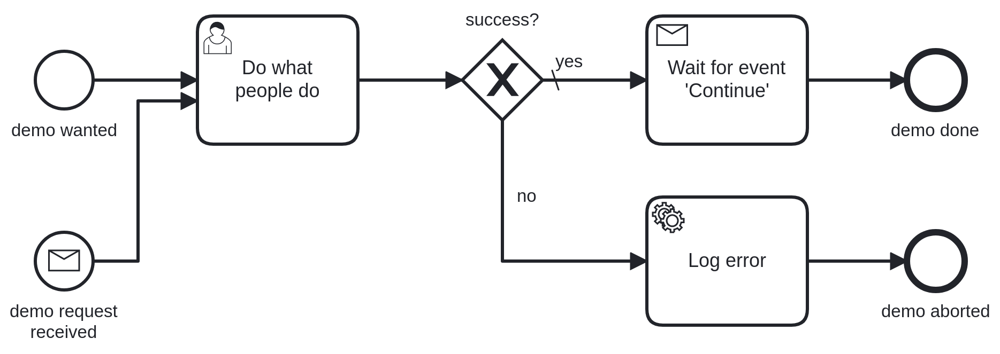

# Demo

This demo was developed as support of the talk "Gain more freedom when migrating from Camunda 7 to 8". This talk is about introducing [VanillaBP](https://www.vanillabp.io) which is an independent API for business processing engines.

The process is quite simple and covers only simple but representative situations one will face developing business processing applications:



If you are interested in a more elaborated example then checkout the [Taxi Ride Blueprint](https://github.com/phactum/taxiride-blueprint).

## Camunda 7

To run it with Camunda 7 use these commands:

```sh
mvn clean package -Pcamunda7
java -Dspring.profiles.active=camunda7 -jar target/demo-0.0.1-SNAPSHOT.jar
```

## Camunda 8

To run it with Camunda 8 you have to [start Zeebe first e.g. by using docker-compose](https://github.com/camunda/camunda-platform).

Afterwards use these commands:

```sh
mvn clean package -Pcamunda8
java -Dspring.profiles.active=camunda8 -jar target/demo-0.0.1-SNAPSHOT.jar
```

## Usage

The demo exposes an REST-API to start the demo-workflow:

`http://localhost:8080/api/demo/4`

The given ID (in this sample `4`) is used to determine the `success` attributed used by the process:  Even numbers are treated as `successful` and odd number as `not successful`.

## Noteworthy & Contributors

VanillaBP was developed by [Phactum](https://www.phactum.at) with the intention of giving back to the community as it has benefited the community in the past.


## License

Copyright 2022 Phactum Softwareentwicklung GmbH

Licensed under the Apache License, Version 2.0
